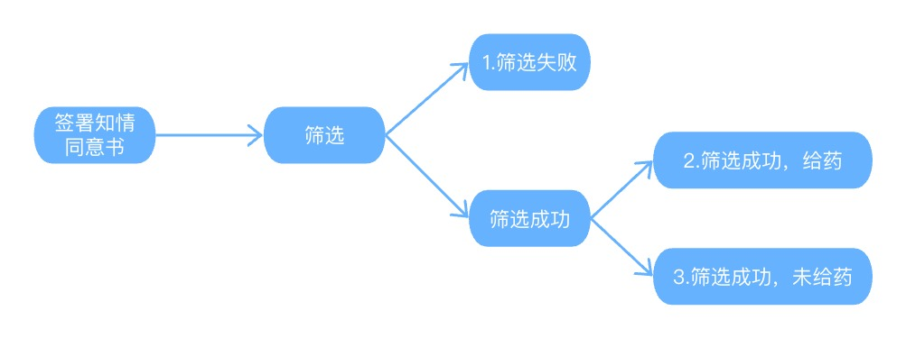
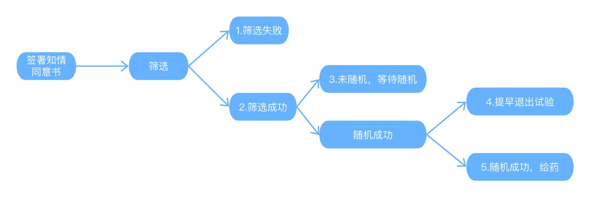

这周被临时调去支援别的小组项目，项目大致情况是从raw data 出几张listing，为医学提供分析支持，了解项目进展情况。
其中我被分到了一张‘人口学特征’列表，表中的‘受试者状态’，让我花费里较多的时间去思考和判断。所以，想在这记录我对于受试者状态取值的判断和思考。

# 不同试验方案与项目进展下，受试者状态可能存在的情况
## 一、对于未锁库，需要随机的项目，受试者状态有如下7个结果，分别是：

- 1.筛选中
- 2.筛选失败
- 2.等待随机
- 3.未给药
- 4.死亡
- 5.治疗结束
- 6.研究结束
- 7.正在进行

## 二、对于锁库，需要随机的项目，受试者状态有如下6个结果，分别是：

- 1.筛选失败
- 2.死亡
- 3.治疗结束
- 4.研究结束
- 5.正在进行
- 6.提前退出试验（随机成功，未给药）

需要注意的是，受试者状态，不存在‘筛选成功+随机失败’这种情况。对于已经锁库的项目，也不应该出现‘筛选中’以及‘等待随机’，‘未给药’这种情况。

## 三、对于未锁库，不需要随机的项目，受试者状态有如下7个结果，分别是：

- 1.筛选中
- 2.筛选失败
- 3.未给药
- 4.死亡
- 5.治疗结束
- 6.研究结束
- 7.正在进行

## 四、对于锁库，不需要随机的项目，受试者状态有如下7个结果，分别是：

- 1.筛选失败
- 2.死亡
- 3.治疗结束
- 4.研究结束
- 5.正在进行

需要注意的是，对于不需要随机的项目，受试者状态不存在‘筛选成功+未给药’，若项目已经锁库，则不应该出现‘筛选中’，‘未给药’这两种情况。

# 随机和筛选概念介绍
在了解受试者状态可能存在的取值差异后，为进一步理解背后的逻辑，下面我将介绍随机和筛选两个概念。

当受试者在签署知情同意书后，受试者需要做一系列的检查，判断其是否符合方案规定的研究人群。那么如何判断是否符合方案规定的研究人群呢？通常来说是需要判断其是否满足入排标准和不符合入排标准。
判断受试者是否符合方案规定的研究人群这个过程，就可以理解为筛选期。对于需要随机的项目，在筛选成功后，进一步要给受试者分配随机号。

# 随机和筛选时间节点
## 不随机的项目
- 不需要随机的项目，以首次给药作为试验开始的节点
- 首次给药前的检查，都属于对入排的复核
- 对于已经锁库的项目，不存在筛选成功，未给药的情况。
对于已经锁库的项目，在首次给药前，若发生任何不符合入排标准的事件，都认为筛选失败，不存在‘筛选成功+未给药’这种情况。比如通常在D-28～D-1期间，受试者筛检合格，判断为符合入排，但因为各种原因，没有马上给药，那么在D-1到首次给药前会有段时间，如果在这段时间内，受试者复查结果不符合入排或受试者不愿意继续参加等，那么这种情况也属于筛选失败。

- 对于未锁库，在dryrun期的项目，医学或者统计师想要了解项目实际进展情况，则会出现以下几种情况：1.等待筛选，2.筛选成功，未给药。

## 随机的项目
- 需要随机的项目，以随机作为试验开始的节点
- 随机之前都是筛选期
- 如果随机成功，但没有给药就退出的，属于提前退出试验
- 不存在筛选成功，随机失败/未随机的情况。
对于已经锁库的项目，在随机化之前，若发生任何不符合入排标准的事件，都认为筛选失败，不存在‘筛选成功+随机失败’这种情况。如果受试者之前筛选成功，但在分配随机号之前，再次检查发现不满足入排或受试者不愿意继续参加的情况，那么这也属于筛选失败。

- 对于未锁库，在dryrun期的项目，则会出现以下几种情况：1.筛选成功，等待随机，2.随机成功，未给药

# 试验进展流程图
## 不需要随机项目

- 图1 dryrun期间，不需要随机项目
<br>
<center>
{width=60%}
<center>

对于锁库的项目，那么只有1.筛选失败，2.筛选成功这两种情况，不存在未给药。

## 需要随机项目

- 图2 dryrun期间，随机项目
<br>
<center>
{width=60%}
<center>

对于锁库的项目，只存在1.筛选失败，2.筛选成功，3.随机成功，给药，4.提早退出试验（随机成功，未给药），不存在筛选成功，随机失败。

# 判断受试者状态的参考代码
```{sas, echo=TRUE, eval=FALSE, class="custom-code-block"}
data common2;
  set common1;
	length stt _dsranum $200;
  
  *筛选中;
	if dsscryn='' then stt='筛选中';
	else if dsscryn='否' then stt='FS';
	else do;
	*筛选成功;
	  if dsranyn='否' then stt='筛选失败';
		else if dsranyn='' then stt='等待随机';
		else if dsranyn='是' then do;
		  if actarmcd='NOTTRT' then stt='未治疗';
      else do;
			   if dthdat^='' then stt='DD';
		     else if eosdat^='' then stt='EOS';
	     	 else if eotdat^='' then stt='EOT';
				 else stt="ONGOING";
			end;
		end;
	end;
run;

```

