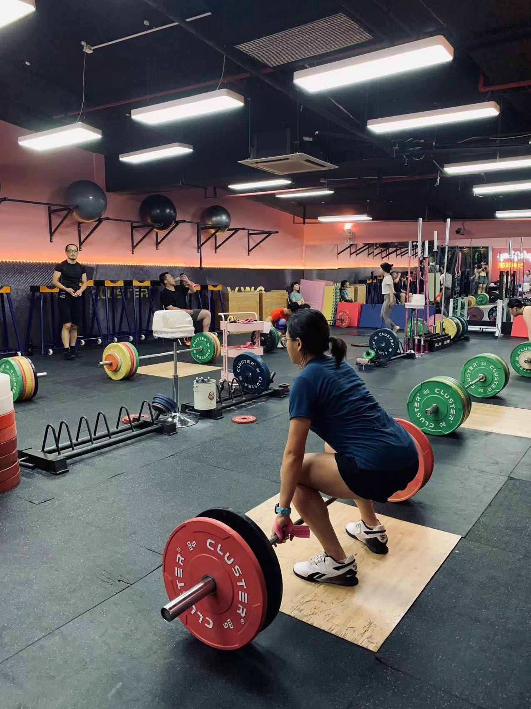

<!-- have to knit first if .Rmd --> 
<style type="text/css">

pred {
  color: red;
  font-weight: bold;
}

pblue {
  color: blue;
  font-weight: bold;
}

</style>


```{r setup, include=FALSE}
knitr::opts_chunk$set(echo = FALSE)
```

在2023年4月，为了消解毕业压力，为生活增加不确定性，毫无健身撸铁基础的我，我走进了一家举重馆，开启了我的举重练习之路。在刚开始学习举重的第一个月，对我来说非常的难，比如无法准确的摆出预备姿势，无法掌握髋膝踝三蹬展等一系列举重技巧，等等等等。但无论如何，我坚持下来了，也逐渐喜欢上了这项运动。  
想在此记录我的最佳个人记录，后续也会不定期更新pr。

<br>
<center>
{width=65%}
</center>

# 抓举 snatch  
- 35kg  

# 挺举 clean&jerk  
- 40kg  

# 后蹲 back squat  
- 75kg  

# 前蹲  
- 60kg


**记录更新至2023-9-27**


